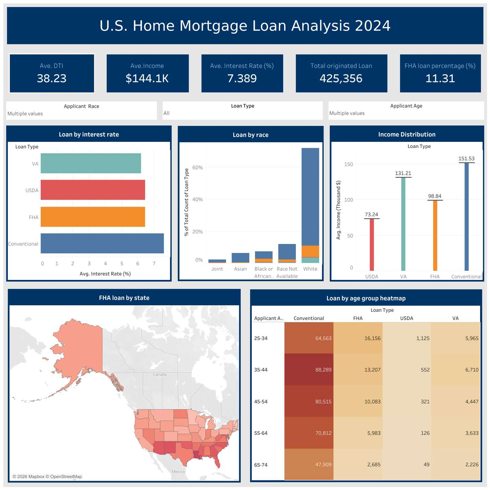

# HMDA 2024 Mortgage Lending Analysis

A graduate group project analyzing 465,939 originated single-family mortgages from the CFPB's 2024 Home Mortgage Disclosure Act (HMDA) Loan Application Register. The project asks whether borrowers in certain income brackets, racial groups, or states are concentrated in loan types that cost more than their financial profile would justify.

## What is inside
| File | Description |
| --- | --- |
| `hmda_lending_analysis.ipynb` | Full modeling notebook with outputs: cleaning, K-Means borrower profiling, and mismatch prediction |
| `tableau_dashboard.png` | The Tableau executive dashboard built on the same cleaned data |

## Approach
- Cleaned a 1,048,575-row federal extract down to 465,939 originated loans (missing-value imputation, placeholder removal, outlier checks)
- Profiled borrowers with K-Means (k = 4) on standardized income, DTI, interest rate, and loan amount
- Flagged Strong and High profile borrowers holding FHA loans as potential mismatches
- Predicted mismatches with logistic regression (ROC-AUC 0.80) benchmarked against gradient boosting, evaluated on a 93,188-loan test set stratified by state
- Delivered results through a Tableau dashboard and an interactive R Shiny app with cross-filtering

## Key findings
- FHA share is 11.6% nationally but roughly 30% for American Indian applicants and 27.6% for Black applicants
- About 5% of well-qualified borrowers (income above $100k, DTI below 40) still originated FHA loans
- Louisiana, Oklahoma, and New Mexico lead both raw FHA share and mismatch rates

## Data
CFPB HMDA Loan Application Register, 2024: https://ffiec.cfpb.gov/data-publication/
The raw extract is not included here due to size; the notebook shows the full cleaning pipeline.

## Team
Four-person group project for a big data management course at Northeastern University.
