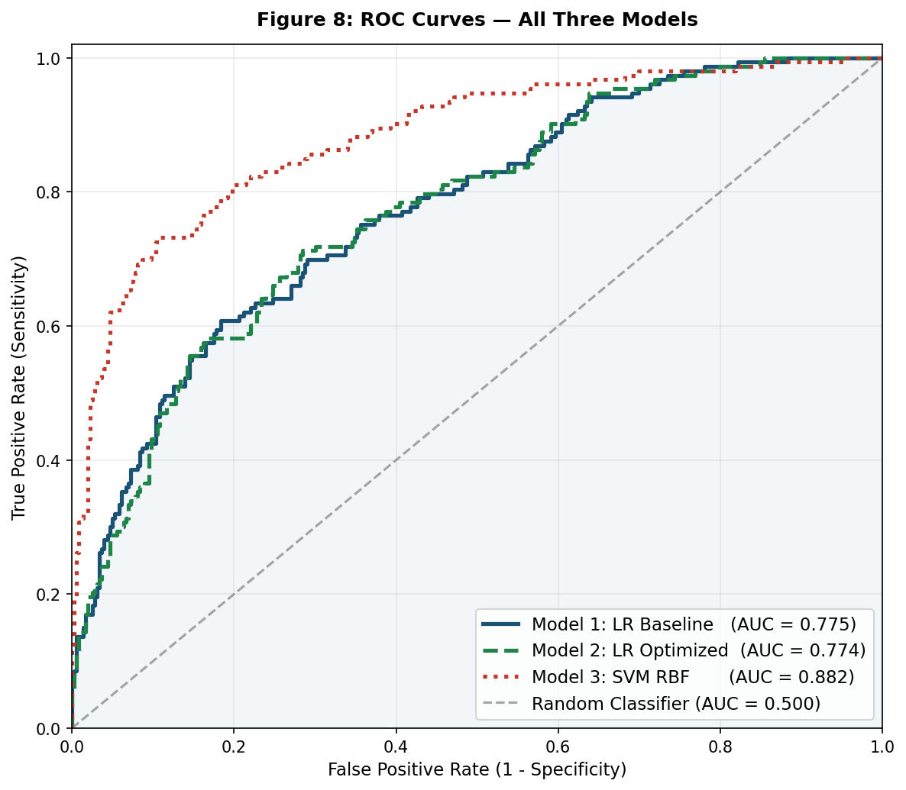
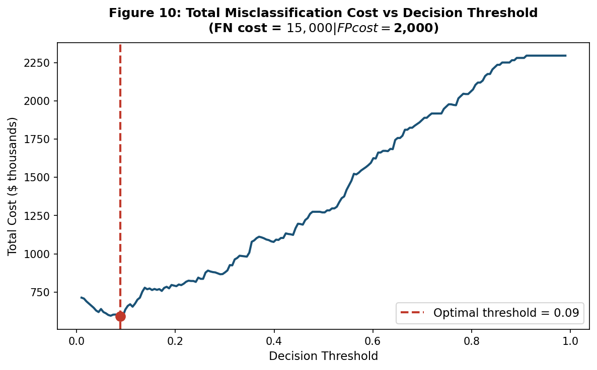

# 🏦 SecureBank Loan Default Prediction

> Predicting which loan applicants are likely to default **before** approval and turning that prediction into a cost-optimal lending policy.


A classification project that builds and compares **Logistic Regression** and **Support Vector Machine** models to estimate the probability that a borrower will default on a loan. The analysis is framed as a **risk-assessment report for a Chief Risk Officer (CRO)**, and explicitly accounts for the asymmetric cost of lending mistakes.

---

## 📋 Table of Contents
- [Business Problem](#-business-problem)
- [Key Results](#-key-results)
- [Findings & Recommendations](#-findings--recommendations)
- [Repository Structure](#-repository-structure)
- [How to Reproduce](#-how-to-reproduce)
- [Methodology](#-methodology)
- [Tech Stack](#-tech-stack)
- [Author](#-author)

---

## 🎯 Business Problem

SecureBank wants to predict loan defaults at the point of application. The two prediction errors are **not** equally costly:

| Error | Meaning | Cost |
|-------|---------|------|
| **False Negative** | Approve a borrower who later **defaults** | **$15,000** |
| **False Positive** | Reject a **creditworthy** borrower | **$2,000** |

That **7.5 : 1 cost ratio** means the model should prioritise **recall** (catching defaulters) over raw accuracy. A classifier that simply predicts "no default" for everyone would score ~70% accuracy yet be useless so this project evaluates models on **F1, recall, and AUC**, and derives a **cost-optimal decision threshold**.

---

## 📊 Key Results

Three models were trained on an 80/20 stratified split of ~2,559 applicants (37 engineered features).

| Model | Features | Accuracy | Precision | Recall | F1 | AUC |
|-------|:--------:|:--------:|:---------:|:------:|:--:|:---:|
| Logistic Regression (baseline) | 37 | 0.766 | 0.634 | 0.510 | 0.565 | 0.775 |
| Logistic Regression (stepwise) | 17 | 0.762 | 0.633 | 0.484 | 0.548 | 0.774 |
| **SVM (RBF kernel)** | 37 | **0.840** | **0.845** | **0.569** | **0.680** | **0.882** |

<p align="center">
  
</p>

**The SVM delivers the strongest discrimination (AUC = 0.88)**, while the stepwise Logistic Regression offers an interpretable, regulation-friendly alternative whose decision threshold can be tuned to the bank's cost structure.

<p align="center">
  
</p>

> Lowering the decision threshold from the default 0.50 toward ~0.12 (where `cost_FP / (cost_FP + cost_FN) = 2000 / 17000`) roughly **halves total expected misclassification cost** on the test set.

---

## 💡 Findings & Recommendations

**Strongest predictors of default**
1. **Checking-account status** - overdrawn accounts default at ~49% vs ~12% for applicants with no checking account.
2. **Loan duration** - each additional standard deviation raises the odds of default by ~36%.
3. **Instalment rate (% of income)** - higher repayment burden strongly predicts stress.
4. **Credit history** - prior delays / critical accounts are classic warning signs.
5. **Savings balance** - little or no savings means no financial buffer.

**Recommendation to the CRO**
- Deploy the **stepwise Logistic Regression** with a **cost-tuned threshold (~0.10–0.12)** as the primary scorecard - it is interpretable (odds ratios), parsimonious (17 features), and aligned to the cost asymmetry. Use the **SVM as a secondary validation model**.
- **Ethics / compliance:** `Personal_Status` (gender-related) and `Is_Foreign_Worker` (national origin) should be **excluded from production scoring** regardless of predictive power, to comply with fair-lending law (e.g., ECOA).
- **Monitoring:** retrain at least annually; track KS-statistic and Gini monthly; retrain if AUC drops below 0.70 on live data.

📄 The full narrative report is in [`reports/SecureBank_Loan_Default_Report.docx`](reports/SecureBank_Loan_Default_Report.docx).

---

## 🗂 Repository Structure

```
loan-default-prediction/
├── data/
│   └── loan_default.csv              # Dataset (~2,559 records, 21 variables)
├── notebooks/
│   └── loan_default_analysis.ipynb   # Full analysis: cleaning → EDA → models → evaluation
├── src/
│   ├── loan_analysis.py              # Script: runs models + builds the Word report
│   └── make_notebook.py              # Programmatically regenerates the notebook
├── reports/
│   ├── SecureBank_Loan_Default_Report.docx   # Risk-assessment write-up
│   └── figures/                      # All 10 generated charts (EDA, ROC, confusion matrices…)
├── requirements.txt
├── LICENSE
└── README.md
```

---

## ⚙️ How to Reproduce

```bash
# 1. Clone the repository
git clone https://github.com/cherylpanashemushangwe-code/loan-default-prediction.git
cd loan-default-prediction

# 2. (Recommended) create a virtual environment
python -m venv .venv
# Windows:
.venv\Scripts\activate
# macOS / Linux:
source .venv/bin/activate

# 3. Install dependencies
pip install -r requirements.txt

# 4a. Explore interactively
jupyter notebook notebooks/loan_default_analysis.ipynb

# 4b. …or run the full pipeline and regenerate the report + figures
python src/loan_analysis.py
```

All paths are resolved relative to the repository, so everything runs without edits after cloning.

---

## 🔬 Methodology

**Data cleaning** - median imputation for missing numerical values (Age, Loan Amount, Loan Duration, Employment Duration); correction of 5 negative loan amounts and 3 impossible ages.

**Feature encoding**
- **Ordinal** for naturally ranked variables (checking/savings balance, employment length, credit history).
- **One-hot** for nominal variables (loan purpose, housing, job type, …) with `drop_first=True`.
- **Binary** for yes/no fields.

**Modeling**
- Standardised features (`StandardScaler`).
- **Logistic Regression** (baseline + backward-stepwise selection via p-values in `statsmodels`).
- **SVM** with an **RBF kernel** to capture non-linear structure.
- Evaluation via confusion matrices, precision/recall/F1, ROC–AUC, and a **business-cost threshold analysis**.

---

## 🛠 Tech Stack

`Python` · `pandas` · `NumPy` · `scikit-learn` · `statsmodels` · `Matplotlib` · `Seaborn` · `python-docx` · `Jupyter`

---

## 👤 Author

**Cheryl Mushangwe**
Analytics

- GitHub: [@cherylpanashemushangwe-code](https://github.com/cherylpanashemushangwe-code)
<!-- - LinkedIn: https://linkedin.com/in/your-handle -->

---

## 📜 License

Released under the [MIT License](LICENSE).

*Dataset used for educational purposes; it is a variant of the well-known German Credit dataset.*
